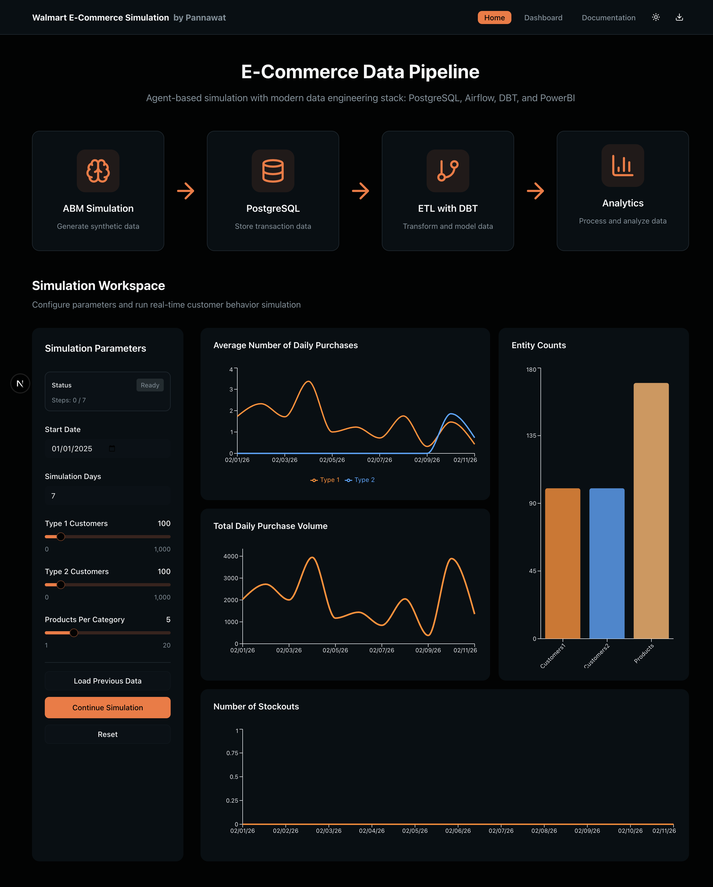

# 🛒  E-Commerce Simulation



<p align="center">
  
  
  
  
  
  
  
</p>

This project is a **portfolio showcase**, using the modern data engineering tech stack to generate synthetic data using Agent-based simulations.  

---

## ✨ What This Project Demonstrates

- **Data Engineering Skills**  
  Building OLTP schema for PostgreSQL, orchestrating pipelines with Airflow, and applying incremental DBT models.  

- **Data Science & Analytics**  
  Simulating customer behavior, segmenting users, and tracking KPIs like CLV and stock‑out rates in PowerBI.  

- **Full‑Stack Development**  
  Designing a Django REST API backend and an interactive Next.js dashboard for near real‑time visualization.  

---

## 🚀 Features

- 📦 **Synthetic Datasets** – Created data models from disparate Kaggle datasets
- 🗄 **Database + ETL** – PostgreSQL + DBT + Airflow + PowerBI
- 💻 **Backend** – Django REST API for simulation & analytics  
- 🎨 **Frontend** – Next.js + Tailwind + ShadcnUI interactive dashboards  
- 📊 **Dashboards** – CLV, AOV, stockout rate, category spend, time series  

---

## 📖 Directory Structure 

```text
backend
│   └── api
│   └── database
│   └── rest_api
docs
data_pipeline
│   └── dags
│   └── dbt
│   └── logs
│   └── method
front_end
│   └── .next
│   └── app
│   └── components
│   └── lib
│   └── public
walmart_EDA
│   └── EDA_scripts
│   └── Model
```

---

## 🖥 Example Dashboard

[To be updated]

---

## ⚙️ How to Run (Simplified)

1. **Clone the repository**
   ```bash
   git clone https://github.com/your-username/walmart-simulation.git
   cd walmart-simulation
   ```

2. **Start backend**
   ```bash
   cd backend
   docker-compose up --build
   ```

3. **Start frontend**
   ```bash
   cd frontend
   npm install
   npm run dev
   ```

4. **Access the project**
   - API → [http://localhost:8000/api](http://localhost:8000/api)  
   - Dashboard → [http://localhost:3000](http://localhost:3000)  

---

## 📈 Roadmap

- [ ] Add recommendation system (collaborative filtering)  
- [ ] Extend supply chain simulation (suppliers → warehouses → retail)  
- [ ] Deploy cloud demo version  

---

## 👨‍💻 Author

This project was created as part of a **Data Science & Analytics portfolio** to demonstrate:  
- Strong SQL & data modeling foundations  
- Ability to design scalable data pipelines  
- Experience in building interactive dashboards and APIs  

---

## 📜 License

MIT License – free to use and adapt.  
